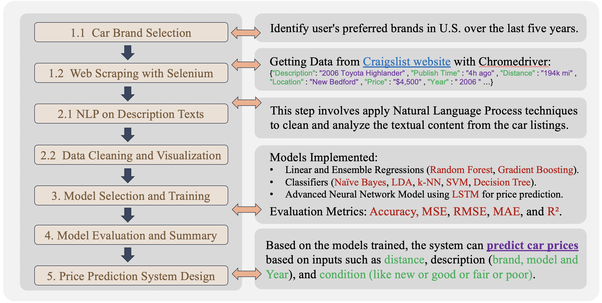

# Used Car Price Prediction System
## [ CS677 Project in 2024]
### Author: Shuaijun Liu
<p align="center">

</p>

### Project Description
This project was a combined analysis and modeling effort to predict used car prices based on data from the [Craigslist website](https://boston.craigslist.org/search/sss?bundleDuplicates=1&postal=02134&query=toyota&search_distance=100#search=1~gallery~0~0). The project took a systems approach to data collection, preprocessing, visualization, and modeling using Python tools and libraries. The goal was to utilize various data science techniques to create a recommendation system that accurately predicts and provides car price estimates based on user input.

<p align="center">

</p>

### Introduction
Welcome to my Used Car Price Prediction System project!  Before you start, you need to make sure that all the necessary preparations have been completed.
1. [Environment Setup Guide](Environment_setup/Installing_Required_Packages.md)
2. [Web Scraping with Selenium Guide](Environment_setup/Web_Scraping_with_Selenium.md)

### 1. Data Acquisition
The initial phase focuses on gathering and preparing data for analysis:

#### 1.1 Car Brand Selection
- **Purpose**: Identify user's preferred car brands based on the most popular brands in the U.S. over the last five years.
- **Method**: Employ the `value_counts()` method on a dataset to determine the popularity of car brands by counting the occurrences within the last five years.
- **Result**: The top 15 car brands are selected based on their popularity and these results are returned as a Pandas Series.


#### 1.2 Web Scraping
- **Tools Used**: Python libraries including Selenium, Pandas, and others for webpage manipulation and data handling.
- **Procedure**:
  - Configuring Selenium WebDriver to mimic browser behavior for dynamic data extraction.
  - Scraping used car data from Craigslist for specific makes and locations in Boston.
  - Extracting detailed attributes of each car listing (e.g., description, time posted, distance, location, price, model year, and URL).
  - Storing extracted data in JSON format for downstream processing.
<p align="center">

</p>

<p align="center">

</p>

Core Function:
```python
def parse_details(driver, url):
    time.sleep(random.uniform(0.5, 2))
    driver.get(url)

    scroll_times = random.randint(1, 3)
    for _ in range(scroll_times):
        driver.execute_script("window.scrollTo(0, document.body.scrollHeight/{})".format(random.randint(2, 4)))
        time.sleep(random.uniform(0.5, 1))

    wait = WebDriverWait(driver, 3)
    try:
        wait.until(EC.presence_of_element_located((By.CSS_SELECTOR, "div.attrgroup")))
        print(f"Success in page: {url}")
    except TimeoutException:
        print(f"No useful infor in page: {url}")
        return {'After_Year': 'NA', 'After_Description': 'NA', 'VIN': 'NA', 'Condition': 'NA', 'Text': 'NA'}

    details_data = {}
    attributes = {
        "After_Year": ('/html/body/section/section/section/div[1]/div[2]/div/span[1]', 'NA'),
        "After_Description": ('/html/body/section/section/section/div[1]/div[2]/div/span[2]/a', 'NA'),
        "VIN": ('/html/body/section/section/section/div[1]/div[3]/div[1]/span[2]', 'NA'),
        "Condition": ('/html/body/section/section/section/div[1]/div[3]/div[2]/span[2]', 'NA'),
        "Text": ('//*[@id="postingbody"]', 'NA')  # Updated XPath
    }

    for attr, (xpath, default) in attributes.items():
        try:
            element = driver.find_element(By.XPATH, xpath)
            details_data[attr] = element.text.strip() if element.text else default  # Use .text to get all contained text
        except NoSuchElementException:
            details_data[attr] = default
        except Exception as e:
            print(f"Error while parsing {attr} for URL {url}: {e}")

    return details_data

```
The combined data is stored in the file: [combined_data/combined_02134_Toyota_100_car_info.json](combined_data/combined_02134_Toyota_100_car_info.json)
```json
{"Description":"2005 Toyota Corolla CE","Publish Time":"4\/11","Distance":"123k mi",
  "Location":"Easton","Price":"$5,950","Year":"2005","URL":"https:\/\/boston.craigslist.org\/sob\/cto\/d\/easton-2005-toyota-corolla-ce\/7736196831.html",
  "After_Year":"2005","After_Description":"Toyota Corolla CE","VIN":"excellent","Condition":"4 cylinders",
  "Text":"Low 123k miles\nAutomatic\nAir Conditioning\n\nNew Battery\nNew Starter\nNew Oil and Filter\nNew Air Filter\nNew Cabin..."}
{"Description":"2015 Toyota Tacoma Bed Topper","Publish Time":"4\/11","Distance":"No Distance",
  "Location":"Nashua","Price":"$500","Year":"2015","URL":"https:\/\/nh.craigslist.org\/pts\/d\/nashua-2015-toyota-tacoma-bed-topper\/7736192718.html",
  "After_Year":"condition:","After_Description":"good","VIN":"NA","Condition":"NA","Text":"Used, good condition,\nshow contact info"}
```


### 2. Preprocessing and Visualization

#### 2.1 NLP on Description Texts
This step involves applying Natural Language Processing techniques to clean and analyze the textual content from the car listings.
- **Operations**:
  - Text extraction from dataset entries.
  - Removal of stopwords, application of stemming and lemmatization to normalize the text.
  - Text vectorization using TF-IDF and Bag of Words models.
  - Implementation of Latent Dirichlet Allocation (LDA) for topic modeling.
  - Sentiment analysis to determine the emotional tone of the text.
  - Calculation of document similarity and keyword extraction using TF-IDF scores.


Core Function:
```python
'''Document Similarity using Cosine Similarity:'''
from sklearn.metrics.pairwise import cosine_similarity

# Calculate the cosine similarity between documents
similarity_matrix = cosine_similarity(tfidf_matrix)

# Get the most similar documents to a given document
document_index = 0
similar_documents = similarity_matrix[document_index].argsort()[::-1][1:6]  # Top 5 similar documents
for doc_index in similar_documents:
    print("Similar Document:", texts[doc_index])
```

#### 2.2 Cleaning and Visualization
- **Data Handling**:
  - Loading and cleaning data from a JSON file to remove incomplete entries.
  - Selection and transformation of key columns for detailed analysis.
- **Visualization Techniques**:
  - Generating various plots (histograms, correlation heatmaps, box plots, and pair plots) to visualize data distributions and relationships.
  - Creating interactive scatter plots using Plotly for dynamic data exploration.

The processed data is stored in the file: [combined_data/processed_toyota_data.json](combined_data/processed_toyota_data.json)
```json
{"Description":"2006 Toyota Highlander","Publish Time":4,"Distance":194,"Location":"New Bedford",
  "Price":4500,"Year":"2006","URL":"https:\/\/southcoast.craigslist.org\/cto\/d\/new-bedford-2006-toyota-highlander\/7739553824.html",
  "After_Year":2006,"After_Description":566,"VIN":"good","Condition":"Good","Text":"Runs and drives great...}
{"Description":"Toyota Camry XLE Fully Loaded 2007 122k mikes","Publish Time":5,
  "Distance":122,"Location":"Indian Orchard","Price":6489,"Year":"2007","URL":"https:\/\/westernmass.craigslist.org\/cto\/d\/indian-orchard-toyota-camry-xle-fully\/7739546475.html",
  "After_Year":2007,"After_Description":535,"VIN":"4T1BE46K57U501281","Condition":"Excellent","Text":"have a 2007 Toyota ...",
  "Condition Numeric":0,"Log Price":8.7778637146}
```

### 3. Model Selection and Training

#### 3.1 Data Preparation and Preprocessing
- **Details**:
  - Encoding categorical variables and preparing features for model training.
  - Splitting data into training (80%) and testing (20%) sets.

#### 3.2 Model Training and Evaluation
- **Models Implemented**:
  - Linear and Ensemble Regressions (Random Forest, Gradient Boosting).
  - Classifiers (Naïve Bayes, LDA, k-NN, SVM, Decision Tree).
  - Advanced Neural Network Model using LSTM for price prediction.
- **Evaluation Metrics**:
  - Regression models are assessed using MSE, RMSE, MAE, and R².
  - Classification models are evaluated through accuracy scores and confusion matrices.

|       Model         |       MSE        |       RMSE       |       MAE        |       R2        |       Accuracy       |                                     Confusion Matrix                                     |
|---------------------|------------------|------------------|------------------|------------------|----------------------|-----------------------------------------------------------------------------------------|
| Linear Regression   | 1.092876e+08     | 10454.068723     | 7638.766117      | 0.231720         | NaN                  | NaN                                                                                     |
| Random Forest       | 2.409568e+07     | 4908.734912      | 2654.638373      | 0.830610         | NaN                  | NaN                                                                                     |
| Gradient Boosting   | 4.341015e+07     | 6588.638173      | 4281.901194      | 0.694831         | NaN                  | NaN                                                                                     |
| Naïve Bayesian      | NaN              | NaN              | NaN              | NaN              | 0.514161             | [[105, 47, 8], [36, 106, 7], [5, 120, 25]]                                              |
| LDA                 | NaN              | NaN              | NaN              | NaN              | 0.457516             | [[72, 6, 9, 27], [41, 34, 30, 20], [16, 18, 29, 20], [21, 15, 18, 28]]                  |
| kNN                 | 3.989881e+07     | 6316.550323      | 3070.912854      | 0.719515         | NaN                  | NaN                                                                                     |
| SVM                 | 8.086734e+07     | 8992.627141      | 5886.015887      | 0.431511         | NaN                  | NaN                                                                                     |
| Decision Tree       | 4.873361e+07     | 6980.946192      | 3552.407710      | 0.657408         | NaN                  | NaN                                                                                     |
| LSTM                | 3.246954e+07     | 5423.035234      | 2857.853403      | 0.821340         | NaN                  | NaN                                                                                     |


### 4. Recommendation System Design
- **Functionality**: Based on the models trained, the system can predict car prices based on inputs such as distance, description (brand and model), and condition.
- **Input Specification**: Users input characteristics like car's condition (ranging from 'New' to 'Poor'), which are then used to estimate prices.

<p align="center">

</p>

<p align="center">

</p>

### Conclusion
This project demonstrates the application of advanced data science techniques in real-world scenarios. Through meticulous data collection, preprocessing, and modeling, the system provides reliable price predictions that can assist users in making informed decisions in the used car market.


